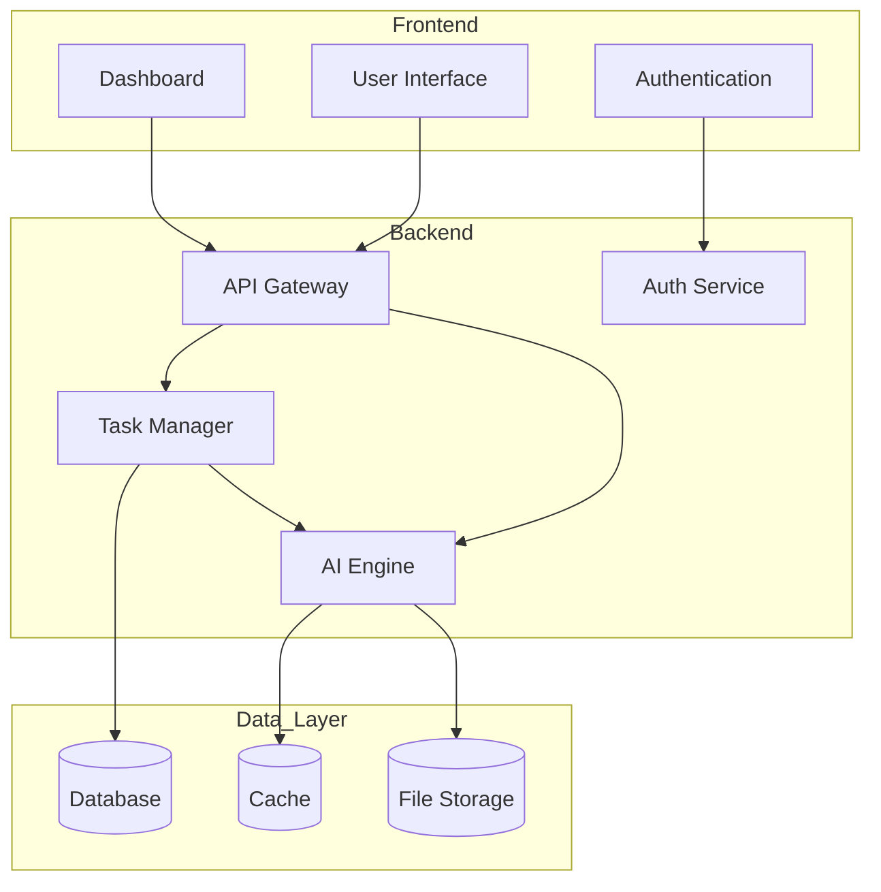

# AI Automation Website Architecture

This document outlines the high-level architecture of our AI automation platform.

## System Overview

## Component Description

### Frontend Layer
- **User Interface**: Main web interface for user interactions
- **Authentication**: Handles user login and session management
- **Dashboard**: Displays automation tasks and results

### Backend Layer
- **API Gateway**: Central entry point for all client requests
- **Auth Service**: Manages user authentication and authorization
- **Task Manager**: Coordinates automation tasks
- **AI Engine**: Core AI processing and automation logic

### Data Layer
- **Database**: Stores user data and task configurations
- **Cache**: Fast access to frequently used data
- **File Storage**: Stores automation artifacts and results